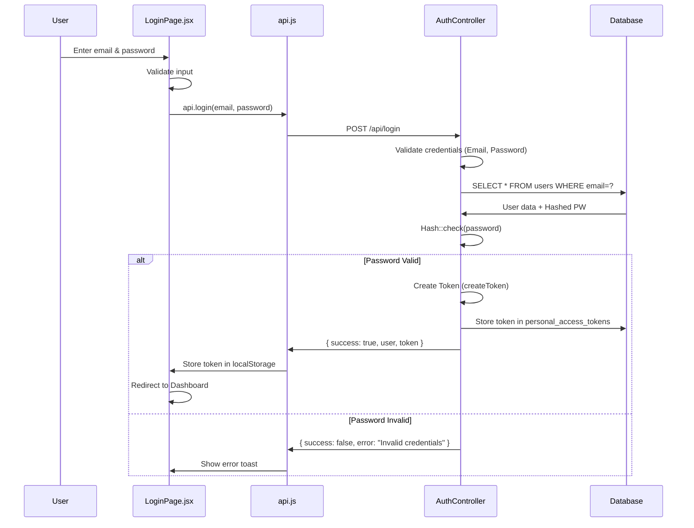
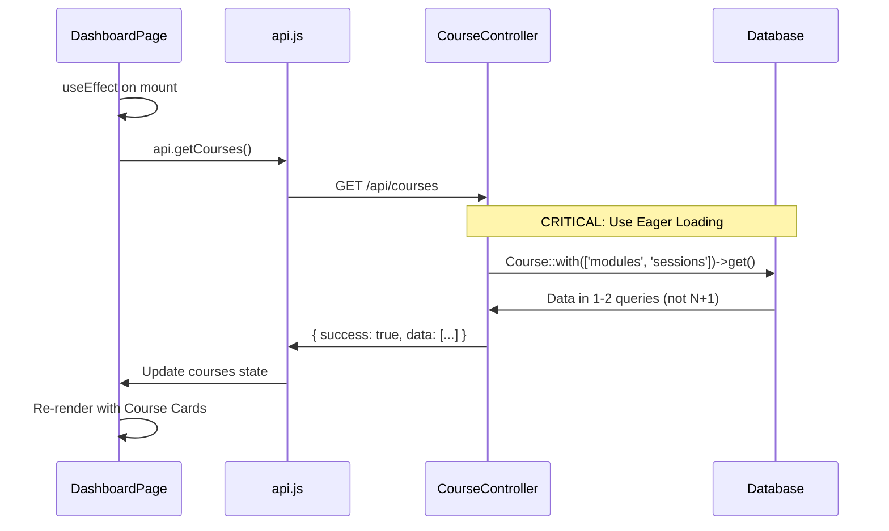
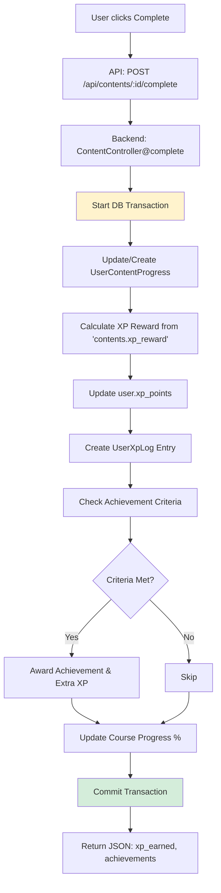
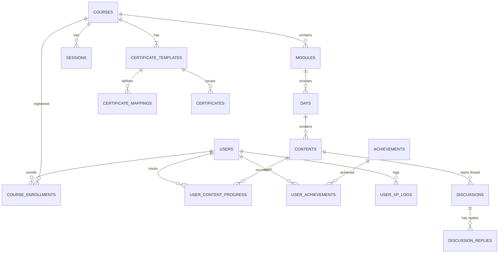

# 🚀 Implementation Flowchart - Backend Magang Guide


---

## 📊 High-Level System Flow

```mermaid
graph TB
    subgraph "Frontend - React"
        A[User Interaction] --> B[Event Handler]
        B --> C[API Service Call]
        C --> D[Loading State]
    end
    
    subgraph "Backend - Laravel 12"
        C --> E[Routes (api.php)]
        E --> F[Middleware Sanctum]
        F --> G[Controller]
        G --> H{Validation}
        H -->|Invalid| I[Return Error 422]
        H -->|Valid| J[Service/Business Logic]
        J --> K[Eloquent Model]
        K --> L[(Database)]
        L --> K
        K --> J
        J --> M[Format Response]
    end
    
    M --> N[JSON Response]
    N --> D
    D --> O[Update UI State]
    O --> P[Re-render Component]
    
    style A fill:#e1f5ff
    style L fill:#ffe1e1
    style M fill:#e1ffe1
```

---

## 🔐 1. Authentication Flow (Sanctum)

### Diagram: Login Process



---

## 📚 2. Course Display Flow (N+1 Prevention)

### Diagram: Fetch & Display Courses



---

## ✅ 3. Content Progress & XP Flow

### Diagram: Complete Content Logic



---

## 📜 4. Certificate Generation Flow

### Diagram: Score Calculation

```mermaid
flowchart TD
    A[Requirement: All contents completed] --> B[Fetch CertificateTemplate for Course]
    B --> C[Fetch CertificateMappings (Weights)]
    C --> D[Loop through Mappings]
    
    D --> E[Calculate Module Avg Quiz Score]
    E --> F[Apply Weight: Score * (Weight / 100)]
    F --> G[Sum to Final Score]
    G --> H{More Mappings?}
    H -->|Yes| D
    H -->|No| I[Final Score >= passing_grade?]
    
    I -->|Yes| J[Generate Certificate ID]
    J --> K[Create Certificate Record]
    K --> L[Return Success]
    
    I -->|No| M[Return Info: Score lower than required]
    
    style B fill:#fff3cd
    style I fill:#cfe2ff
```

---

## 🗄️ 5. Database Schema (ERD)



